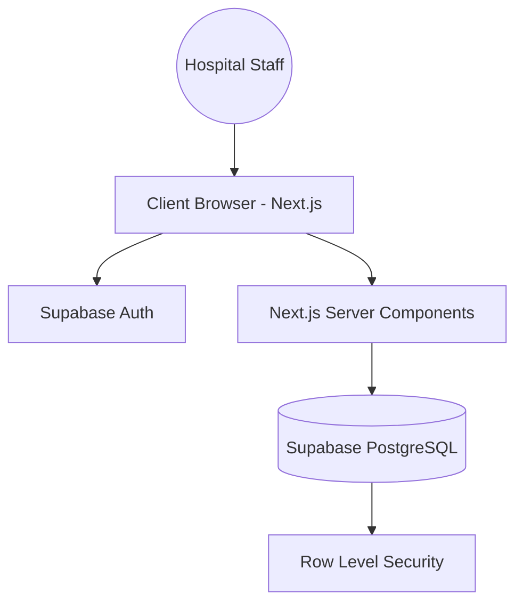
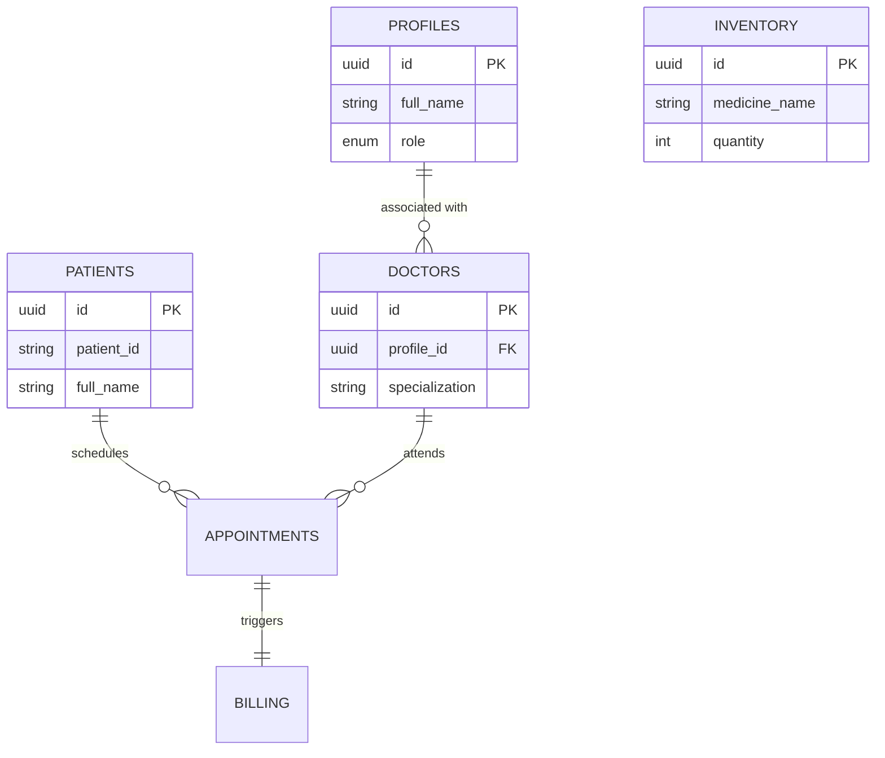

# PROJECT DOCUMENTATION: HOPI SYNC

## COVER PAGE
**Project Title**: Hopi Sync - Modern Hospital Administrative System with Glassy Architecture  
**Candidate Name**: [User Name]  
**Department**: Computer Science and Engineering  
**Academic Year**: 2025-2026  
**Guide**: [Guide Name]  

---

## CERTIFICATE
This is to certify that the project entitled **"Hopi Sync"** is a bonafide work carried out by **[User Name]** in partial fulfillment of the requirements for the degree of Bachelor of Technology.

---

## ACKNOWLEDGMENT
I wish to express my sincere gratitude to the department and my guide for their continuous support and guidance throughout the development of this Modern Hospital Administrative System.

---

## TABLE OF CONTENTS
1. [Abstract](#abstract)
2. [Chapter 1: Introduction](#chapter-1-introduction)
3. [Chapter 2: System Analysis](#chapter-2-system-analysis)
4. [Chapter 3: System Design](#chapter-3-system-design)
5. [Chapter 4: Module Description](#chapter-4-module-description)
6. [Chapter 5: Testing](#chapter-5-testing)
7. [Chapter 6: Conclusion & Future Enhancement](#chapter-6-conclusion)
8. [Appendices](#appendices)

---

## Abstract
Hopi Sync is an innovative, high-performance hospital administrative system designed to streamline healthcare operations through a modern, interactive interface. Built with **Next.js 15**, **Tailwind CSS**, and **Supabase**, the system offers a proprietary "Glassy Bubbly" UI that enhances user engagement while maintaining clinical efficiency. Key features include centralized patient records, dynamic specialist scheduling, real-time inventory tracking, and automated billing workflows, all secured within a robust PostgreSQL-backed infrastructure.

---

## Chapter 1: Introduction

### 1.1 Project Overview
Hopi Sync addresses the complexity of modern healthcare management by providing a unified platform for administrators, doctors, and clinical staff. It replaces fragmented legacy systems with a cohesive digital environment.

### 1.2 Purpose & Scope
The purpose of Hopi Sync is to digitize hospital workflows, reducing manual errors and improving patient care speed. Its scope includes appointment scheduling, medical history tracking, pharmacy stock management, and financial auditing.

### 1.3 Objectives
-   Implement a high-fidelity, responsive UI for clinical workflows.
-   Ensure real-time data synchronization across departments.
-   Provide actionable analytics for administrative decision-making.
-   Guarantee record security via Row Level Security (RLS).

---

## Chapter 2: System Analysis

### 2.1 Existing System (Drawbacks)
-   **Manual Logging**: High risk of transcription errors and lost paperwork.
-   **Siloed Data**: Difficulty in sharing patient history between departments.
-   **Inefficient Scheduling**: Long wait times and overlapping appointments.
-   **Poor Accessibility**: Limited remote access to critical medical data.

### 2.2 Proposed System (Advantages)
-   **Automated Workflows**: Fast patient registration and instant billing.
-   **Centralized Repository**: Single source of truth for all clinical data.
-   **Advanced UI/UX**: Minimizes cognitive load for staff through intuitive design.
-   **Real-time Alerts**: Low-stock pharmacy warnings and schedule notifications.

### 2.3 User Requirements
-   **Admin**: Total system control, audit logs viewing, and department configuration.
-   **Doctor**: Access to patient records, diagnosis entry, and personal schedule management.
-   **Receptionist**: Patient onboarding, appointment booking, and bill generation.

### 2.4 Hardware & Software Specifications
**Software**:
-   **Framework**: Next.js 15 (App Router)
-   **Language**: TypeScript
-   **Database**: Supabase (PostgreSQL)
-   **Styling**: Tailwind CSS + Glassmorphism Utilities
-   **Icons**: Lucide React

---

## Chapter 3: System Design

### 3.1 System Architecture
The system follows a modern Serverless Architecture with a decoupled frontend and backend.

### 3.2 Database Design (ER Diagram)
The database is structured to support relational integrity between auth users, internal profiles, and clinical entities.

---

## Chapter 4: Module Description

### 4.2 Module 1: Authentication & Access Control
-   **Purpose**: To secure the system and ensure only authorized staff can access patient data.
-   **Functionality**: Supabase Auth integration with role-based redirection.
-   **Input**: Staff Email/Password.
-   **Output**: Encrypted session token and role-specific dashboard access.

### 4.3 Module 2: Staff Management (Specialists)
-   **Purpose**: Management of the clinical roster and specialist expertise.
-   **Functionality**: Specialist registration, department assignment, and availability tracking.

### 4.4 Module 3: Pharmacy & Inventory
-   **Purpose**: Real-time tracking of medicine stock and expiry dates.
-   **Functionality**: Stock adjustment, low-inventory alerts, and medicine categorization.

---

## Chapter 5: Testing

### 5.1 Testing Strategy
We employ a multi-layered testing strategy:
1.  **Unit Testing**: Verifying individual utility functions and UI components.
2.  **Integration Testing**: Ensuring smooth data flow between Supabase and Next.js wrappers.
3.  **UI Verification**: Auditing the Glassmorphism theme across different screen sizes.

---

## Chapter 6: Conclusion

Hopi Sync successfully modernizes hospital administration by combining cutting-edge web technologies with a user-centric design philosophy. It provides a robust foundation for scalable healthcare management.

### Future Enhancements
-   **AI Diagnostics**: Integration of machine learning models for diagnosis assistance.
-   **Telemedicine**: Video conferencing module for remote patient consultation.
-   **Mobile App**: Dedicated Flutter or React Native mobile client.
